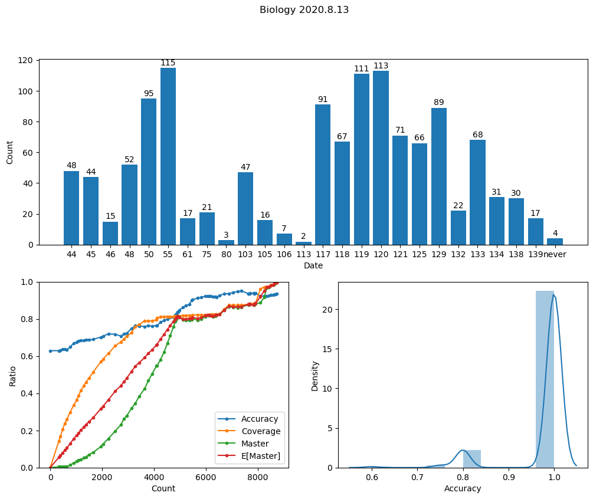
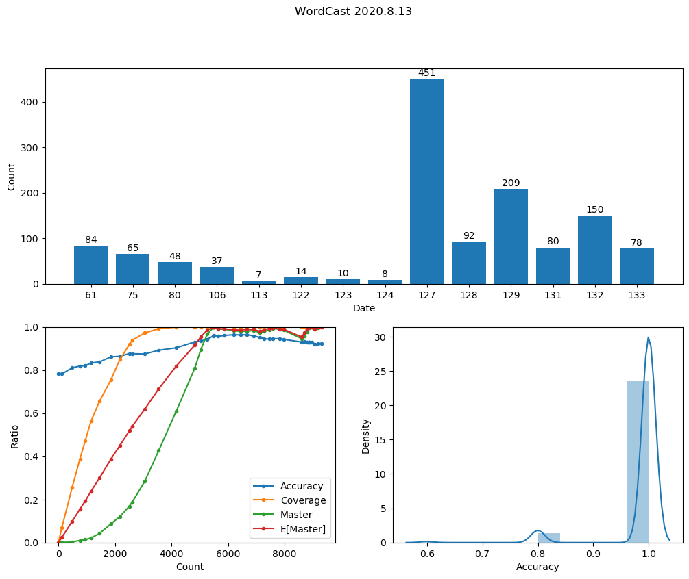
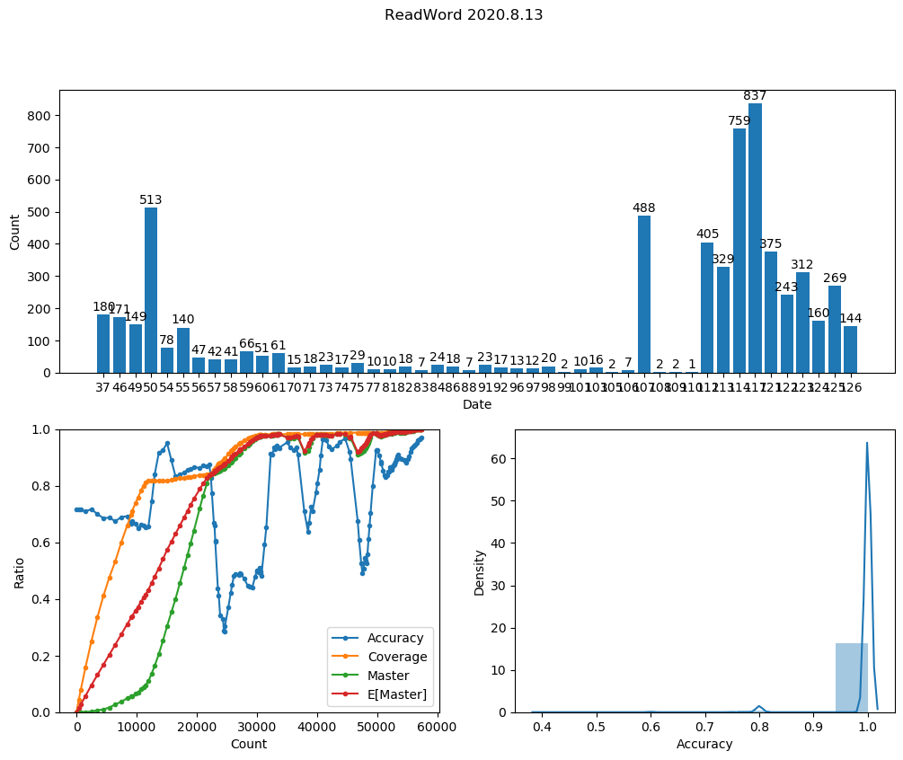

# NCEEHelper

## 一段废话
如果~~不一定存在的~~学弟学妹们能看到OI-Source，他们应该能看到这个。这也是给他们留的。

如果他们看完了OI-Source，应该就能知道我的OI生涯是有多么迷茫和痛苦了。我花费了大量的时间和精力最后却只得到程序员的各种职业病。

去年，OI退役后，我离高考只剩一年时间，我的排名掉到段100名开外，除了数学和英语课外几乎都听不懂，一天睡67节课，课程教完时我每科都落下接近一半的课程。

此时我该怎么办？为了完成自己在高中阶段给自己定下的计划，也就是在高中阶段完成一个可扩展的渲染器基础架构，用于大学后的进一步研究。最终我还是顶着压力每天中午写代码，也就有了Piper。Piper虽然比我预想的目标远了许多，但至少我已经明白了自己要学什么，做什么，研究什么。时间拖到了12月。

此时的我成绩还是很烂，不过高考考得怎样我不是太在乎，毕竟我的高中计划完成了一半（另一半2018年流产了，但我严格执行计划，也没有什么可后悔的，只能说是遗憾吧）。成绩烂到什么地步呢？段排名在60-200名间跳跃，而且化学考过26，理综考过140。

Piper的开发暂停了，接下来要做什么呢？于是我就有了NCEEHelper这个想法。事实上它只是一个工具平台和一堆脚本的组合体。我让计算机做的，不过是帮我测试和收集、分析数据。事实上整个开发过程还是很苦的，我要去接触Python/SQL/HTML/JavaScript/CMake等陌生的东西，自然语言处理、可视化这些很少接触的领域，生物的数据库几乎靠人工逐字录入，语文的语料库怎么弄都得不到想要的结果，测试时手腕甚至疼到按不下键盘。

为什么要弄这个呢？我希望自动化一些繁琐的东西，让笔记活起来。相比人工手写笔记，NCEEHelper能够自动按照各种加权算法为你提供题目，
也能进行统计了解你这段时间的复习情况，还能从网络上获取高频词汇。这些都是人工能做到的，但并不是人工应该做的。

测试统计（这事实上是一种增强自信的方法，要不然我为什么还要加个E[Master]?）

为什么我能够做到阅读词汇测试50min1000个，生物测试30min200个呢？除了不用打字和较为熟练外，更大的原因是我在测试的过程中尽可能不让自己思考。这也就是为什么我没有把生物知识点拆分成树形结构的原因。哈希表和树的性能差异，想必你们应该清楚。我通过付出更多的时间（其实应该是更少）去构建这一个hash表，从而保证了我的做题速度。（之前的理综练习中生物最快只要15min）

其实这些东西你们也不一定用得上（毕竟高考改革了），不过我想下面几句话应该是通用的：

+ 要把学习成果量化，告诉自己每天的练习是有进步的，如果进步不大请像我一样再加一个E[Master]。
+ 要选择适合自己的学习方式，并坚持下去。如果不知道什么适合自己，那就随便选一个并告诉自己它最“适合自己”。
+ 要时常问自己“你要干啥”，对比一下“你在干啥”，评估当前的事情是否有意义，及时纠偏，抓住重点。
+ 只要按照自己计划的路线认真做了，不论结果怎样，问心无愧。

补充一下对如今OI的看法：其实它挺好的，能让我学到不少东西，可惜它不是我所喜欢的。个人对moe这几年来如此突然的做法感到反感（说好的政策早三年知道呢），对因此而遭受利益损失的OIer表示同情（或许我也是？）。仍然希望CCF和NOI能够更加透明，提高比赛服务质量，继续推进信息学在我国的普及与发展。虽然中国在某些方面还存在着缺陷，但总体来说还是不断在进步，因此自己的利益损失无力挽回，也不必计较。

高考加油吧。

写于2020/6/14
## 高考后
高考成绩：641（估分649，在误差范围内）
省排名：2592（估计前1000，严重翻车）
语文：124（估分109，作文按40分算，难道我作文实际55？）
数学：130（估分137，实在想不出哪里扣分了）
英语：136（估分136，作文按20分算，真就20分）
理综：251（估分267，仍然想不出哪里扣分，难道生物写得比参考答案具体也不行？）

首先得吐槽一下我糟糕的估分水平。
总分和语文成绩是我高三以来考得最高的一次，尤其是语文给了我很大的惊喜。
当然今年的考卷在数学和理综上没能展示我的优势，是一大遗憾。

虽然成绩说实话不是很理想，但对于一个从高三才开始正式读书的“常年失踪人口”来说，也算是令我自己满意了。

很遗憾这种基于计算机复习的方法在今年的高考中并没有体现它的优势。语文实验失败，英语阅读过于简单导致词汇量优势无法体现，生物的规范表达可能还坑了我不少分数。。。但长远来看，这套方法令我从百名开外回到年段第三（应该），我个人认为这些付出和痛苦是值得的。

我糟糕的高考成绩并不能报一所计算机专业较好的大学，不过幸运的是今年我父亲让我报名了南方科技大学的综合评价测试，最终在几天前我有幸被其录取（可能是三明区域内第一个考上南方科技大学的学生？）。值得一提的是，当初报名时由于我自己此前从未听说过它，csrankings上更差不到它的名字，我在报名时并不抱很大期望，也没有投入过多的精力去准备报名材料，最终。。。。这就是所谓的“无心插柳柳成荫”吧。（怎么和我写作文一样？）

我借这件事希望同学们能够珍惜自己遇到的每一个机会，说不定哪天它会给你一个小惊喜。

高考考不好也不要太在意，它不过是一个固定的“目标函数”罢了。我一直努力让自己成为凸包上的一个顶点，总有一天能遇上适合自己的“目标函数”。

写于2020/8/13

有没有好心人（用计算机）帮我把gugugu的内容修正到markdown上啊？？

deadline还有不到2个月，不知道能不能撑得住。
## 使用
请移步 [GetStarted](GetStarted.md)
